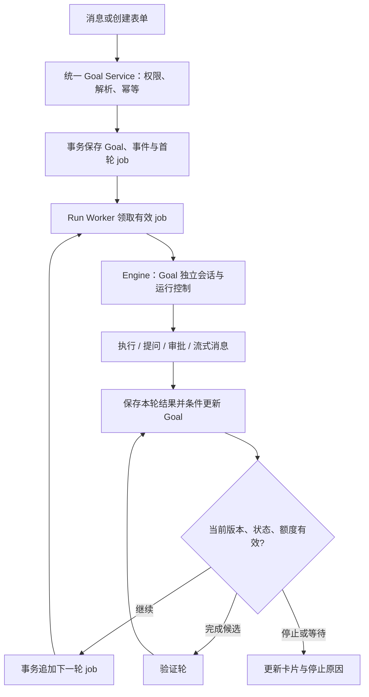

# Goal 技术方案

状态：待评审；基于 `test` 分支 `0483924`。配套 [产品方案](goal-product-design.md)。新增模块与协议均为提案，尚未实现。

## 1. 现有实现与改造边界

| 当前模块 | 当前行为 | Goal 改造 |
| --- | --- | --- |
| `messaging/router.ts` | 命令必须从 `/` 开始；普通 @ 消息中断同频道同 Agent 的运行 | 增加 Goal 入口解析、线程消息归属及中断协调 |
| `agents/run-worker.ts` | 持久化任务队列；成功后触发回复中的 mention 链；重启把 running job 标成 failed | Goal job 完成通知调度器；不触发 mention 链；分类恢复 |
| `agents/engine.ts` | 一次 trigger 对应一次回复；TriggerResult 只有文本、耗时和 ok 等 | 加 Goal 上下文、运行关联、结构化结果及预算统计 |
| `runtime_sessions` | 按 runtime/agent/channel 唯一保存会话 | 为 Goal 建独立会话存储及 app-server key |
| `agents/run-manager.ts` | 内存控制器中止 run，run id 为项目内整数 | 控制键加 project/workspace，接入 Goal 的暂停与取消 |
| `db/index.ts` | schema v6；LRU 句柄池，仅列出已打开项目 | 幂等迁移、活跃项目扫描、执行中的 DB 引用保护 |
| 输入/审批 manager | 等待请求及 respond 回调在内存中 | 关联 Goal；重启失效的请求进入恢复流程 |
| `web/lib/useChannelCommands.ts` | 基于 workflow 和线程控制命令提供提示 | 合并 Goal 内置命令及冲突提示 |

采用 OpenSpace 持久化 Goal 调度层，复用现有 Engine/Adapter 执行每轮。无须给运行时透传字面量 `/goal`；不得仅靠提示词“持续运行”代替调度。Goal 与 Workflow 各自拥有状态机，首版不把 Goal 包成固定 YAML 工作流。

## 2. 执行链路



Scheduler 只决定下一轮类型（plan/execute/verify）及是否入队，不占用单独的模型会话。Worker 执行每轮结束后调用 `onGoalJobSettled`；周期扫描补偿崩溃窗口，禁止纯内存循环连续调用 Agent。

## 3. 数据模型与迁移

新表存入项目 `.openspace/openspace.db`，Goal id 使用 UUID。所有时间采用现有数据库时间单位并在共享类型中明确。以下是逻辑字段，实施时补充 SQL CHECK、索引及外键。

| 表 | 主要字段 |
| --- | --- |
| `goals` | id、channel_id、thread_root_id、agent_id、created_by、source_message_id、objective、requirements_json、plan_json、criteria_json、status、reason_code、reason_detail、version、generation、requirements_revision、current_job_id、max_rounds、rounds_used、max_active_ms、active_ms、next_run_at、summary、created_at、updated_at、ended_at |
| `goal_iterations` | id、goal_id、job_id、agent_run_id、sequence、kind、generation、requirements_revision、status、report_json、reply_message_id、runtime_turn_id、started_at、ended_at、active_ms、error_code |
| `goal_events` | id、goal_id、goal_version、type、actor_type、actor_id、payload_json、created_at、idempotency_key |
| `goal_runtime_sessions` | goal_id、runtime、session_id、created_at、updated_at |
| `goal_requests` | channel_id、user_id、client_request_id、operation、goal_id、result_json、created_at；唯一(channel_id,user_id,client_request_id) |

`agent_run_jobs` 新增可空 `goal_id`、`goal_iteration_id`、`goal_generation`、`goal_kind`；`agent_runs` 新增可空 `goal_id`、`goal_iteration_id`。普通 job 保持原路径。

索引与约束：每 Goal 最多一个 queued/running job；每 Goal 的 sequence 唯一；每线程最多一个未终止 Goal；每目标事件的幂等 key 唯一。负责人/线程等关联记录删除前需终止 Goal，历史引用优先 SET NULL 并保留快照，不能静默级联删除审计记录。

`version` 用于客户端条件更新；`generation` 在暂停、取消、补充要求及重启中断时递增，屏蔽旧任务结果；`requirements_revision` 在目标要求变更时递增，完成证据必须对应最新 revision。

新增 schema v7（如实施前版本已推进，使用下一个实际版本），遵循 `db/index.ts` 的幂等迁移。依赖新增列的索引放在 ALTER TABLE 之后，覆盖 fresh DB 与 v6 升级。DDL 不修改项目元数据中的 `goal`。

## 4. 命令与请求协议

新增 `goals/command-parser.ts`、`service.ts`、`repo.ts`、`scheduler.ts`、`report.ts`、`recovery.ts` 和 `routes/goals.ts`。

独立解析 Goal 语法，不放宽所有既有命令的 mention 前缀规则。解析器返回 command、目标正文、显式负责人、目标 id；身份解析使用现有 mention resolver，但拒绝 all、多负责人、不在频道的 Agent 以及不支持的 runtime。Goal 入口先于普通 mention 的 abort/enqueue；解析为 Goal 后即使有错也返回结构化错误，不回退普通聊天。

`/goal` 无正文或负责人不唯一时返回 `goal.compose_required`，让浏览器打开表单；没有连接的客户端得到文本提示和可用负责人列表。用户消息仍作为历史保存，但 Goal job 的实际 prompt 使用服务端规范化内容。

建议 REST：

```text
GET  /api/projects/:projectId/channels/:channelId/goals
POST /api/projects/:projectId/channels/:channelId/goals
GET  /api/projects/:projectId/goals/:goalId
POST /api/projects/:projectId/goals/:goalId/actions
GET  /api/projects/:projectId/goals/:goalId/events?after=<eventId>
```

创建 body 含 `client_request_id, objective, agent_id, thread_id?, acceptance_criteria?, limits?`；action 含 `client_request_id, expected_version, action, content?, limits?`。指定 projectId 避免只在当前打开 DB 里反查。REST 和聊天命令必须进入同一个 service。

`send_message` 扩展可选 `client_request_id`；新客户端 Goal 操作必须携带稳定 id 并在断线重试时复用。服务端事务保存去重结果、消息、Goal 和首轮 job；重复请求返回同一结果。旧客户端无 id 时只能承诺单请求处理，不能声称传输层 exactly-once。

WebSocket 增加 `goal.updated`、`goal.event`、`goal.compose_required`；事件带 project_id/channel_id/goal_id/version，仅向有权限的订阅者推送。前端丢弃旧版本，遇到版本跳跃、重连或刷新则 GET 快照。订阅权限撤销要移除连接订阅，不能只在 REST 检查。

## 5. 调度、状态与竞争处理

可调度的持久状态为 queued/running/verifying；running/verifying 通过 job 记录判断是否真的有活跃轮次。awaiting_input/approval 保留当前 run，等待解决前不安排下一轮。paused/failed 无活跃 job；pausing/cancelling 可以尚有正在退出的旧 run。

领取 job 的短事务须同时验证：Goal generation 与 job 一致、状态允许、当前 job 关联正确、额度未超、权限仍有效、workspace 执行锁可取得。进入 adapter 之前再次检查中止信号，避免暂停发生在领取后仍启动工具。

完成事务保存 iteration 结果、累计耗时、推进 Goal version、写事件并创建后继 job。只有匹配当前 generation 和 requirements_revision 的结果可改变 Goal；旧结果留作历史。排队中已计入 rounds_used（领取时递增），启动失败也消耗一轮，避免无限失败循环。

暂停/取消：先事务变更为 pausing/cancelling、递增 generation、取消 queued job，再向对应项目的 run 发送 abort。确认退出后转 paused/cancelled。没有活跃 run 时直接完成转换。用户在 pausing/cancelling 时恢复返回 409，不能与尚未退出的旧轮次并行。

补充要求：追加原文，增加 requirements_revision/generation，取消旧队列并中断当前轮次；确认退出后重新排 plan job。暂停状态只保存补充、不自动恢复。已完成/取消状态返回 409。多用户竞争通过 expected_version 返回 409 并刷新，所有操作留 actor 记录。

普通 @ 消息的现有“中止同 Agent”入口必须先通知 Goal service，将相关 Goal 暂停。Stop all 包括 queued、等待用户及运行中的 Goal。Goal 回复不走 `enqueueChainedAgentRuns`，避免误触发第二条调度链。

相同 workspace 的 Goal 按入队时间公平轮转，每次只派一轮；复用全局 `MAX_CONCURRENT_PROCESSES`。锁按规范化 workspace 绑定，跨项目别名不能绕过。首版部署限定单个 server 调度进程，启动时检测重复调度实例并拒绝；多进程支持需要数据库租约与 fencing，不能只用进程内 Map 声称互斥。

运行控制 Map 的键从项目内 runId 改成 `projectId/runId` 或规范化 `workspace/runId`，贯穿 abort、heartbeat、complete 和审批关联，避免不同项目相同整数 id 相互中止。

## 6. 会话、上下文与轮次报告

Goal 使用 `goal_runtime_sessions` 保存会话；app-server key 增加 goalId，例如 `workspace:agent:channel:goal`。普通聊天会话不被 Goal 覆盖。首次上下文含目标、项目背景、验收标准及授权边界；后续轮次含最新要求、进度摘要、剩余额度、未完成项和本轮任务。会话失效时开新会话并重建摘要，不能从头盲目重复外部操作。

扩展 TriggerContext：goalId、iterationId、generation、kind、规范化 prompt 与 session scope；扩展 TriggerResult：runId、aborted、timedOut、错误类别、结构化报告、实际 usage（若存在）。执行成功不等于 Goal 完成。当前 engine 的文本长度 token estimate 不能用于硬预算。

首版让 Agent 在最终输出末尾提供严格的版本化报告块，服务端校验后从聊天正文剥离并写入 iteration；流式 UI 需缓冲报告块起始标记，避免把内部 JSON 展给用户。不能读取工具输出或引用文本中的伪报告作为控制指令。

```json
{
  "schema_version": 1,
  "goal_id": "uuid",
  "iteration_id": "uuid",
  "generation": 3,
  "requirements_revision": 2,
  "outcome": "continue",
  "summary": "已完成实现，仍需运行相关测试",
  "next_action": "运行登录模块测试",
  "criteria": [{"id": "c1", "state": "passed", "evidence": [{"type": "artifact", "ref": "src/login.ts", "detail": "新增验证码输入"}]}],
  "blocker": null
}
```

outcome 允许 continue/completion_candidate/needs_input/blocked；平台生成和核对 id/revision，不让模型指定任意 Goal。验收项 id 服务端稳定分配，模型不能删除用户要求或放宽其标准。报告只表示 Agent 的主张，不授予权限；工具执行仍走 adapter。

completion_candidate 排 verify 轮；验证报告要覆盖最新 revision 下全部必需验收项，证据可关联实际工具记录/测试退出状态/产物或明确人工确认。矛盾、空证据或遗漏不能 completed。人工验收在等待输入状态提供独立确认按钮。

报告缺失/非法：最多一次受额度约束的修复轮；再次失败暂停 `invalid_report`。临时执行错误最多两次退避重试（建议 5s/30s），仍计入总轮数和运行时间；授权错误/不支持 runtime 不自动重试。连续三轮无进展暂停 `no_progress`。这些策略配置有上限。

## 7. 额度、等待与恢复

累计 active_ms 包括 adapter 执行及调度占用的执行时间；等待提问/审批事件明确切换计时段并暂停运行时超时计时，排队时间不计。每个 run 的定时器按剩余 active_ms 在轮内触发 abort，并由 generation 屏蔽迟到结果；计时段持久化，不能仅在回调结束时扣时。模型实际 usage 可展示但不作为首版硬额度。

等待请求关联 goalId、projectId、runId 和 generation；用户回答后继续同一个活跃 turn，不创建新的 job。拒绝审批通知 Agent 寻找可行替代；不能由 scheduler 自动批准。等待过久（建议 24h、可配置）中断 turn 并暂停 `input_expired`，释放 runtime 资源；待用户恢复后重新提问。

服务启动及每次项目 DB 打开都做恢复：

- 未启动的 queued job 经有效性检查继续。
- 服务重启时 running/等待中的轮次外部执行结果不确定，标记 interrupted，Goal 暂停 `server_restarted`；不自动重放。
- 已提交结果但尚无后继 job，由事务记录和补偿扫描决定一次续排；唯一约束防重复。
- pausing/cancelling 若确认旧服务不再运行，完成对应状态转换；不能直接忽略仍存在的 runtime。
- 内存审批/提问回调丢失后关闭旧卡片；用户恢复时重新创建问题，旧请求回答返回 409/410。

调度器扫描已登记项目中的有活跃 Goal 项目，不能只依赖 listOpenDbs。DB 执行期间需要引用计数/pin 防 LRU 或 idle close；释放后按现有策略关闭。清理时先停 scheduler、撤销 queued 派发，再中断/等待 run、记录恢复状态，最后关闭 DB。

## 8. 前端与接口权限

新增 `stores/goals.ts`、`GoalCard.tsx`、`GoalPanel.tsx`、`CreateGoalDialog.tsx`；接入 ChannelPage/ThreadPanel、useChannelCommands 和 api/ws 客户端。Goal 卡片用 message metadata 中的 goal_ref 引用服务端事实；每轮输出仍复用 MessageList 的流式能力。

创建时主频道消息作为线程根；已有线程中沿用已验证属于该频道的根消息。内部续跑 prompt 用关联 iteration 的内部数据保存，不作为用户消息，也不触发 mention/任务创建。

所有 REST、聊天命令、后台领取、WebSocket 推送都校验项目/频道归属。查看/创建要求 canAccessChannel；控制要求创建者仍可访问或 canManageChannel；runtime 审批复用现有权限。成员移除、Agent 移出频道、项目关闭/删除触发暂停或取消及释放资源，不能仅依赖前端禁用按钮。

## 9. 实施顺序与验证

1. 数据迁移、repository、状态机、命令解析及 service；完成创建/暂停/取消的幂等和权限测试。
2. Worker/Engine 接入、Goal 独立 session、运行控制复合键、结构化报告及续跑/验证闭环。
3. 轮内额度、等待处理、DB pin、启动/打开项目恢复和普通消息/Stop all 协调。
4. 卡片、详情、输入补全、创建表单、动作入口、断线刷新和命令冲突提示。
5. 开启功能开关 `OPENSPACE_GOALS_ENABLED`，先在 test 环境用低额度验证；默认开启前完成下表验收。关闭开关时拒绝新创建，暂停已有 Goal 并中断运行，不移除历史数据。

| 层级 | 必须覆盖的场景 |
| --- | --- |
| Parser | `/goal`、两种负责人位置、中文目标、空目标、@all/多负责人、正文/代码中的字面量、控制 id、已有 trigger 冲突 |
| SQLite/Service | v6/fresh migration、重复创建、单活跃 job、版本冲突、目标/频道跨项目访问、创建者权限撤销 |
| Worker/Engine | continue→verify→complete、旧 generation 回调、领取后暂停、aborted 优先于 exitCode 成功、两项目相同 runId、Goal session 与聊天隔离 |
| Budget/Recovery | 轮数与轮内时间上限、等待不扣时、无进展、非法报告重试、重启不重放、关闭 DB/懒打开项目、取消期间崩溃 |
| UI/E2E | @ 前缀补全、无负责人选择、Goal 线程普通补充、审批回答、Stop all 后不重启、重连快照、历史与证据可追溯 |

完成实现时执行 `pnpm typecheck`、相关测试和 lint，再用真实 runtime 跑低额度 smoke：目标跨至少两轮完成；验证失败后继续修复；中途暂停与服务重启；运行中追加要求；拒绝权限审批后不自动重试批准。当前提交只有方案文档，不表示这些功能已交付。
